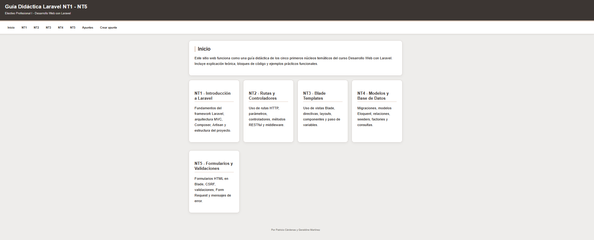
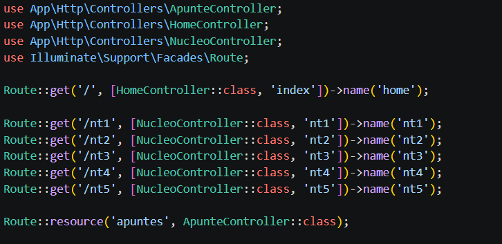
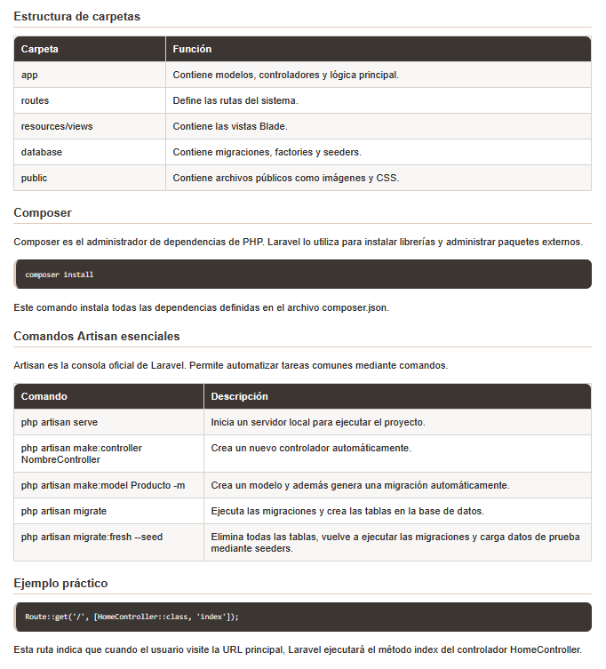
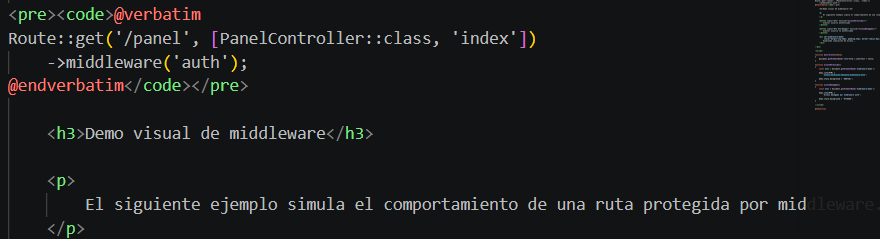
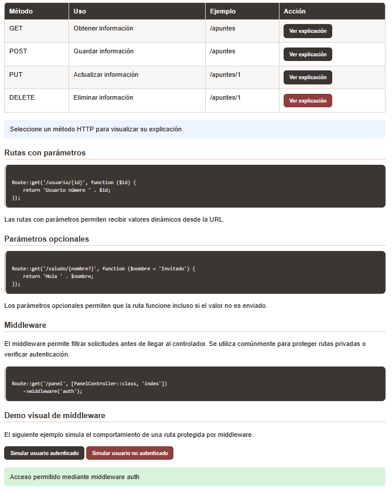
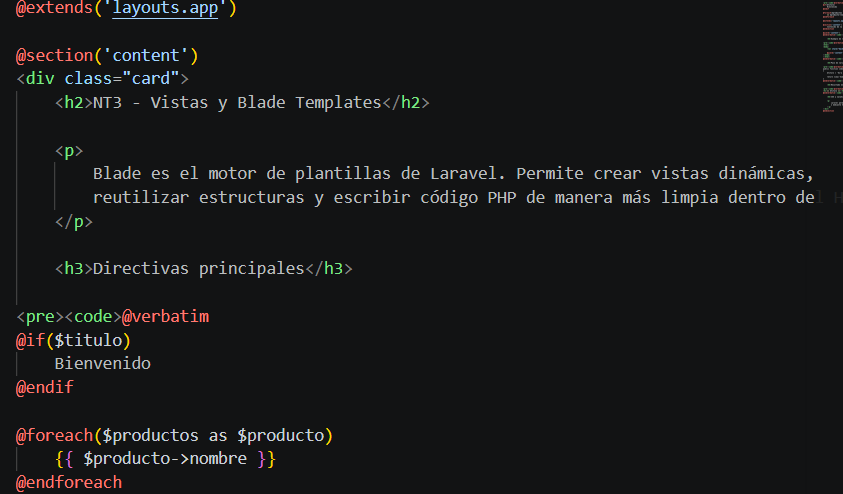
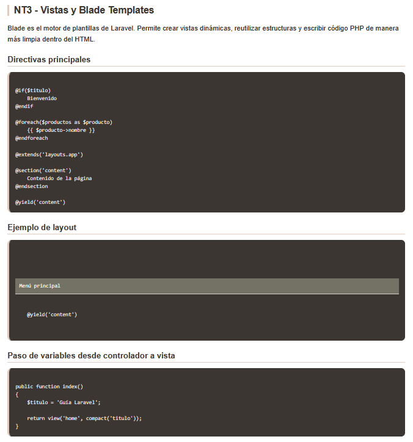
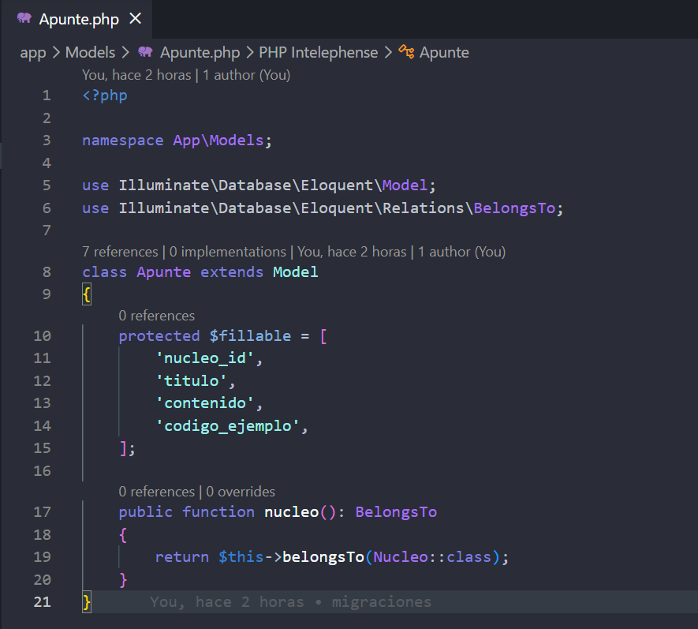
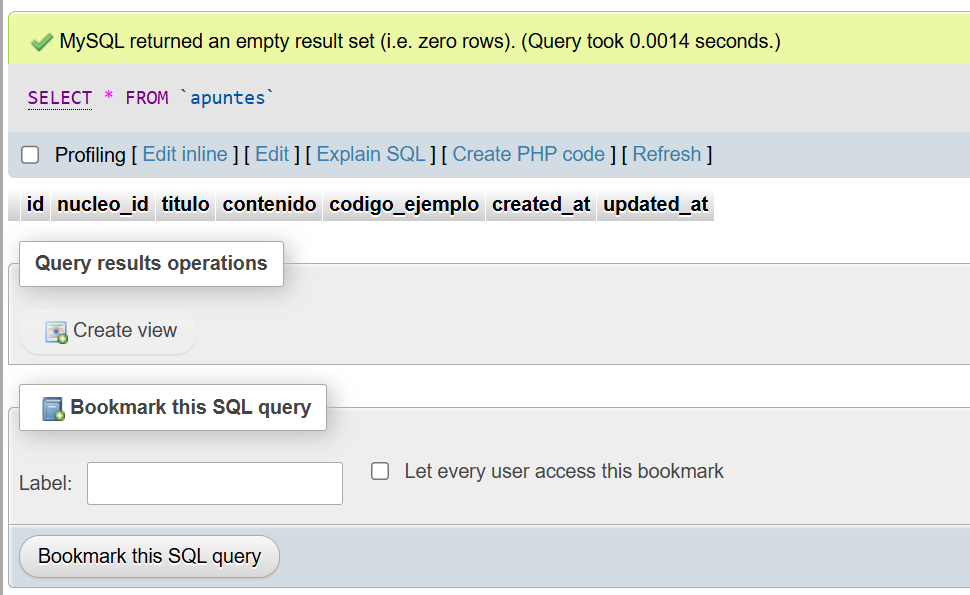

# Guía Didáctica Laravel NT1 - NT5

## Integrantes

- Patricio Cárdenas
- Geraldine Martinez

---

# Descripción del proyecto

Este proyecto corresponde a una guía didáctica desarrollada en Laravel que abarca los núcleos temáticos NT1 al NT5 del módulo Desarrollo Web con Laravel.

La aplicación incluye:

- Explicaciones teóricas.
- Ejemplos de código.
- Uso de rutas y controladores.
- Sistema de vistas Blade.
- Conexión a base de datos MySQL.
- Uso de modelos Eloquent.
- CRUD funcional de apuntes.
- Formularios con validación.
- Demostraciones interactivas de middleware y métodos HTTP.

El objetivo principal es demostrar el uso práctico del framework Laravel mediante una aplicación web funcional conectada a base de datos.

---

# Tecnologías utilizadas

| Tecnología | Uso |
|---|---|
| PHP 8 | Lenguaje principal |
| Laravel 12 | Framework backend |
| MySQL | Base de datos |
| XAMPP | Servidor Apache y MySQL |
| Composer | Administrador de dependencias |
| Blade | Motor de plantillas |
| Visual Studio Code | Editor de código |

---

# Requisitos del sistema

Antes de ejecutar el proyecto se debe tener instalado:

- PHP 8 o superior
- Composer
- XAMPP
- MySQL
- Visual Studio Code
- Git

---

# Instalación del proyecto

## Paso 1 - Clonar repositorio

```bash
git clone https://github.com/Takumishii/guianucleoslaravel.git
```

---

## Paso 2 - Ingresar al proyecto

```bash
cd guianucleoslaravel
```

---

## Paso 3 - Instalar dependencias

```bash
composer install
```

---

## Paso 4 - Configurar archivo .env

Duplicar el archivo:

```txt
.env.example
```

y renombrarlo como:

```txt
.env
```

---

## Paso 5 - Configurar conexión a base de datos

Abrir el archivo `.env` y modificar:

```env
DB_CONNECTION=mysql
DB_HOST=127.0.0.1
DB_PORT=3306
DB_DATABASE=evaluacion2laravel
DB_USERNAME=root
DB_PASSWORD=
```

---

## Paso 6 - Crear base de datos

Ingresar a phpMyAdmin y ejecutar:

```sql
CREATE DATABASE evaluacion2laravel;
```

---

## Paso 7 - Generar APP_KEY

```bash
php artisan key:generate
```

---

## Paso 8 - Ejecutar migraciones y seeders

```bash
php artisan migrate:fresh --seed
```

Este comando:

- crea las tablas
- ejecuta migraciones
- inserta datos iniciales

---

## Paso 9 - Iniciar servidor Laravel

```bash
php artisan serve
```

---

## Paso 10 - Abrir aplicación

Ingresar en el navegador:

```txt
http://127.0.0.1:8000
```

---

# Verificación de funcionamiento

La instalación se considera correcta si:

- Laravel inicia correctamente.
- La página principal carga.
- Los núcleos NT1 a NT5 son visibles.
- El CRUD de apuntes funciona.
- La base de datos guarda información.
- Las validaciones muestran errores correctamente.

---

# Funcionalidades implementadas

## NT1 - Introducción a Laravel

- Arquitectura MVC
- Composer
- Artisan
- Estructura de carpetas
- Flujo Request → Route → Controller → View → Response

## NT2 - Rutas y Controladores

- Rutas GET, POST, PUT y DELETE
- Rutas con parámetros
- Parámetros opcionales
- Middleware
- Tabla interactiva de métodos HTTP

## NT3 - Blade Templates

- Directivas Blade
- Layouts
- Variables dinámicas
- Vistas reutilizables

## NT4 - Modelos y Base de Datos

- Migraciones
- Modelos Eloquent
- Relaciones
- CRUD conectado a MySQL

## NT5 - Formularios y Validaciones

- Formularios Blade
- CSRF
- Validaciones
- Form Request
- Mensajes personalizados de error

---

# Estructura del proyecto

```txt
app/
database/
resources/views/
routes/
public/
```

---

# Capturas de pantalla

## Inicio del sistema




---

## NT1 - Introducción a Laravel




---

## NT2 - Rutas y Controladores




---

## NT3 - Blade Templates




---

## NT4 - Base de Datos y Eloquent





---

## NT5 - Formularios y Validaciones

(Pegar captura aquí)

---

## CRUD de apuntes

(Pegar captura aquí)

---


# Distribución de trabajo

## Integrante 1

- Init
- Layout principal
- Navegación
- NT1
- Requests
- NT2
- NT3
- README pt1
- Estilos CSS pt1

## Integrante 2

- Base de datos
- Migraciones
- CRUD
- NT4
- NT5
- Validaciones
- README pt2
- Estilos CSS pt2

---

# Commits realizados

El proyecto incluye commits realizados por ambos integrantes utilizando GitHub.

---

# Conclusión

Laravel permite desarrollar aplicaciones web modernas utilizando una arquitectura organizada basada en MVC.

El framework facilita la creación de rutas, controladores, vistas, modelos y validaciones, reduciendo el tiempo de desarrollo y mejorando la mantenibilidad del sistema.